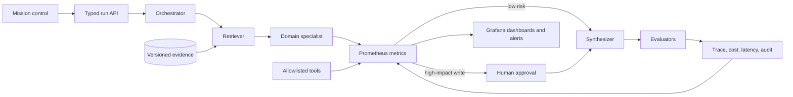

# Agentic Systems Lab

An inspectable portfolio of the engineering work required to make AI agents useful in an enterprise: orchestration, retrieval, tool use, approvals, evaluations, observability, APIs, testing, and documentation.

This is not a chatbot gallery. It is one connected system with three realistic workflows, three Grafana observability projects, a browser-based mission control, a TypeScript runtime, a Python API reference, automated evaluations, and a security/governance layer.

> All companies, cases, people, account details, and policy text in this repository are synthetic. Nothing here represents Citi systems, Citi data, or a claim about Citi's internal architecture.

## See it in 60 seconds

```bash
npm install
npm run dev
```

Open [http://localhost:3000](http://localhost:3000), choose a workflow, and click **Run workflow**. No key or paid account is required.

For a complete verification pass:

```bash
npm run check
```

That command runs linting, TypeScript checks, unit tests, agent evaluations, and a production build.

To run the separate Prometheus and Grafana lab:

```bash
docker compose -f observability/docker-compose.yml up --build
```

Open Grafana at [http://localhost:3001](http://localhost:3001). Synthetic traffic starts automatically and populates all three dashboards. Docker is required, but no Grafana sign-up or API key is needed. See [Observability and Grafana](docs/OBSERVABILITY_AND_GRAFANA.md) for the full walkthrough.

## What is in the repository

| Part | What it does | Why an employer cares |
|---|---|---|
| `src/app` | Next.js mission control and typed API routes | Shows a usable product, not only backend code |
| `src/lib/engine.ts` | Runs the agent graph from request to decision | Shows orchestration and explicit control flow |
| `src/lib/policy.ts` | Allows, blocks, or sends actions for approval | Shows AI safety as executable policy |
| `src/lib/evaluation.ts` | Scores grounding, task success, policy, and citations | Shows repeatable quality measurement |
| `src/lib/scenarios.ts` | Defines the workflows, evidence, tools, and expected decisions | Keeps product behavior in one auditable source of truth |
| `apps/agent-api` | A small FastAPI/Pydantic implementation of the same trust boundary | Shows Python, typed contracts, validation, and container delivery |
| `observability` | Prometheus, three provisioned Grafana dashboards, alerts, and a load generator | Shows SLOs, PromQL, metrics design, dashboards-as-code, and incident signals |
| `evals` + `scripts` | Golden cases and the regression runner used by CI | Prevents prompt or workflow changes from silently reducing quality |
| `docs` | Architecture, security, interview guide, skills map, access, resume export | Makes the work understandable to engineers and non-engineers |
| `.github/workflows` | Node and Python quality gates | Shows production delivery discipline |

## The three projects

### 1. Payment exception triage

**Simple explanation:** several agents investigate a delayed payment. One reads the ledger, one retrieves screening evidence, one recommends an action, and a risk reviewer checks the rules. Because money movement is high impact, the system can request approval but cannot release funds itself.

**Engineering evidence:** multi-agent routing, typed tool allowlists, maker-checker approval, safe defaults, immutable trace, and policy tests.

### 2. Policy evidence assistant

**Simple explanation:** the agent answers an employee's policy question only from approved, dated documents. Every answer carries its evidence identifiers, and an evaluator checks that the citations cover the answer.

**Engineering evidence:** RAG design, source versioning, relevance metadata, structured outputs, citation coverage, and hallucination controls.

### 3. Customer remediation planner

**Simple explanation:** the agent turns a service failure into a sequence of owned work: validate who was affected, calculate the correction, obtain approval, execute, and reconcile. Write tools create drafts; they do not silently change customer records.

**Engineering evidence:** durable workflow thinking, idempotent design, service boundaries, auditability, deadlines, and guarded write actions.

## Three observability and Grafana projects

### 1. Agent SLO Command Center

**Simple explanation:** answers whether the agent is working reliably. It shows successful outcomes, p95 latency, error-budget burn, throughput, and the human-approval backlog.

**Engineering evidence:** Prometheus counters and histograms, PromQL aggregation, SLO thinking, bounded labels, and a low-success alert.

### 2. Cost-Quality Correlator

**Simple explanation:** compares model cost and token use with evaluation quality. It helps explain whether a more expensive model is producing enough quality improvement to justify its cost.

**Engineering evidence:** cost per run, quality per dollar, model/scenario filters, evaluation telemetry, and capacity/cost reasoning.

### 3. Tool Reliability Lab

**Simple explanation:** identifies which agent tool is failing, retrying, or slowing down. This helps separate model problems from dependency problems.

**Engineering evidence:** tool-level RED-style metrics, histogram quantiles, retry analysis, failure concentration, and a tool error-rate alert.

## How everything connects



In plain language:

1. The UI sends a validated scenario ID to the API.
2. The orchestrator selects a bounded workflow instead of giving the model unlimited freedom.
3. The retriever supplies approved evidence and keeps the source IDs.
4. A specialist constructs a decision from that evidence.
5. Policy code checks the selected tool and the action risk.
6. High-impact actions stop for a person; the safe default is no change.
7. Evaluators score the result and telemetry records how the run behaved.

See [Architecture](docs/ARCHITECTURE.md) for component boundaries and failure behavior.

## Quality, safety, and operations

- **Typed boundaries:** Zod validates the web API; Pydantic validates the Python API.
- **Least privilege:** every workflow declares its tools and whether each tool is read or write.
- **Human approval:** high-risk writes produce an approval request, not an autonomous side effect.
- **Safe failure:** missing or unknown tools are blocked; API errors do not expose internals.
- **Deterministic demos:** reviewers get stable results with no key, network, or vendor dependency.
- **Evaluation before deployment:** golden cases enforce minimum scores and expected approval behavior.
- **Operational visibility:** each run includes latency, tokens, cost estimate, tool calls, retries, and a stable trace ID.
- **Metrics and alerting:** the Python service exports bounded Prometheus metrics used by three Grafana dashboards and provisioned alert rules.
- **Supply-chain care:** pinned safe framework versions, Dependabot, CI, containers, and no committed secrets.

See [Security and governance](docs/SECURITY_AND_GOVERNANCE.md) for the threat model and production controls.

## Optional live integrations and sign-ups

The local portfolio needs **no sign-up**. The web demo requires Node.js; the Grafana lab additionally requires Docker. Optional production extensions are documented in [Access requirements](docs/ACCESS_REQUIREMENTS.md):

- OpenAI API for live model generation
- LangSmith or an OpenTelemetry backend for hosted tracing
- Grafana Cloud for hosted metrics, dashboards, and alerting; the included local Grafana needs no account
- Pinecone or another vector database for managed retrieval
- Vercel for a public web deployment
- GitHub for CI and portfolio hosting

Each is isolated behind an adapter or environment variable. No provider is required to understand or verify the core engineering.

## Interview and resume material

- [Skills matrix](docs/SKILLS_MATRIX.md) maps common job requirements to code and a concise talking point.
- [Interview walkthrough](docs/INTERVIEW_WALKTHROUGH.md) provides a five-minute demo narrative and likely follow-up questions.
- [Resume export](docs/resume/CITI_AGENTIC_AI_RESUME_EXPORT.md) turns the demonstrated skills into honest, believable Citi-style examples without claiming that this portfolio used real Citi data or systems.

## Technology choices

- **Next.js + React + TypeScript** for the product and API surface
- **Zod** for runtime input validation
- **Vitest** for runtime and policy unit tests
- **FastAPI + Pydantic** for a Python service reference
- **Pytest + Ruff** for Python quality gates
- **Docker Compose** for repeatable local startup
- **GitHub Actions** for continuous verification

## Repository principles

1. Show the control plane, not only the happy-path answer.
2. Treat tools as permissions, not as convenient functions.
3. Measure agent behavior with testable contracts.
4. Make high-impact actions reversible or approval-gated.
5. Keep the default demo portable, deterministic, and free.

## License

MIT. See [LICENSE](LICENSE).
