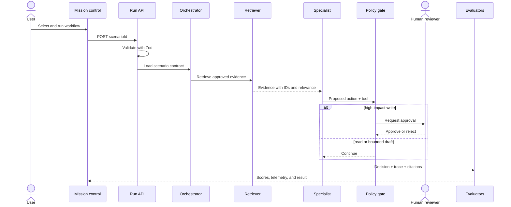

# Architecture

## Executive view

The lab separates **reasoning**, **permissions**, and **verification**. A model or deterministic planner may propose an action, but only policy code decides whether that action is allowed, and evaluators independently decide whether the result meets quality thresholds.

This separation matters because an LLM is probabilistic. It should not also be the authority that grants itself access or declares its own output correct.

## Runtime sequence

## Component boundaries

### Scenario registry

`src/lib/scenarios.ts` is the behavioral source of truth. Each scenario declares:

- its business goal and risk level;
- the input that starts the workflow;
- the evidence the deterministic demo can retrieve;
- the tools the workflow is allowed to call;
- the expected safe decision;
- whether a person must approve the final action.

Keeping these facts together makes review easier. A security reviewer can compare the declared risk, tools, and approval requirement without reconstructing them from prompts.

### Orchestration engine

`src/lib/engine.ts` executes a bounded state machine with five roles:

1. **Orchestrator** classifies the request and selects a known workflow.
2. **Retriever** returns approved evidence with source identifiers.
3. **Specialist** maps the evidence to the business goal.
4. **Risk reviewer** applies code-based policy to the selected tool.
5. **Synthesizer** returns the decision, citations, and next safe action.

The demo does not claim that five independent LLM calls are always better. These are logical roles. A production implementation can assign them to separate models, one model with distinct prompts, or deterministic services according to cost, latency, and risk.

### Policy boundary

`src/lib/policy.ts` accepts a scenario and tool name. It never accepts a free-form claim like “this is safe.” It checks the declared allowlist, the tool permission, and the workflow risk. An unknown tool is blocked. A high-risk write is allowed only as an approval request.

### Evaluation boundary

`src/lib/evaluation.ts` scores four independent dimensions:

| Metric | Question |
|---|---|
| Groundedness | Are the selected sources relevant to the decision? |
| Task success | Did the workflow reach a valid result state? |
| Policy compliance | Did the risk reviewer permit or correctly gate the action? |
| Citation coverage | Did the result retain all required evidence references? |

The weighted score is useful for a release gate, but the individual metrics are kept because a single score can hide why a run failed.

### Provider adapter

`src/lib/providers/openai.ts` is optional and isolated. The default runtime does not import it, so builds and demos never require a key. In production, a provider call can generate a summary after the same evidence and policy boundaries have run. Model output does not bypass those boundaries.

### Python service

`apps/agent-api` demonstrates the same trust boundary using FastAPI and Pydantic. This is intentionally small: it shows a typed service contract and policy function without duplicating the web application.

## Data and state

The portfolio uses in-memory synthetic fixtures to remain portable. A production design would add:

- PostgreSQL for run, approval, and audit state;
- object storage for large evidence artifacts;
- a vector/hybrid index for retrieval;
- a durable queue for long-running work and retries;
- a secret manager for provider credentials;
- OpenTelemetry traces with business identifiers redacted or hashed.

## Failure behavior

| Failure | Safe behavior |
|---|---|
| Unknown scenario | Return `404`; do not invent a workflow |
| Invalid request | Return `400/422` with validation details |
| Unknown tool | Block at the allowlist |
| Missing evidence | Fail citation coverage and prevent release |
| High-risk write | Hold state and create an approval request |
| Model/provider outage | Keep deterministic workflow state; retry only idempotent steps |
| Evaluator below threshold | Mark the release gate failed and retain the trace |

## Scaling path

1. Move run state to PostgreSQL and add idempotency keys.
2. Execute long steps through a durable workflow engine or queue.
3. Replace fixture retrieval with hybrid search and document access controls.
4. Add model routing by complexity, latency budget, and data classification.
5. Export OpenTelemetry spans and connect evaluation failures to a review queue.
6. Add adversarial, privacy, and bias test suites before expanding tool permissions.
