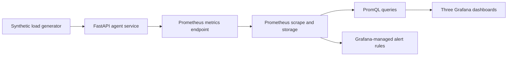

# Observability and Grafana lab

This folder contains three focused observability projects. They all use the same small stack, so a reviewer can start it once and explore different operational questions without creating any accounts.

## Start the complete lab

You need Docker Desktop or another Docker Compose-compatible runtime.

```bash
docker compose -f observability/docker-compose.yml up --build
```

Then open:

- Grafana: [http://localhost:3001](http://localhost:3001)
- Prometheus: [http://localhost:9090](http://localhost:9090)
- FastAPI documentation: [http://localhost:8000/docs](http://localhost:8000/docs)
- Raw Prometheus metrics: [http://localhost:8000/metrics](http://localhost:8000/metrics)

Grafana dashboards are viewable anonymously in this local lab. No Grafana account is required. The local admin password is intentionally set to `portfolio-local-only`; it is not a production credential.

Stop and remove the containers with:

```bash
docker compose -f observability/docker-compose.yml down
```

## How the parts connect



In simple language:

1. The load generator sends safe, fake workflow requests to the API.
2. The API records counters, gauges, and histograms at `/metrics`.
3. Prometheus collects those numbers every five seconds.
4. Grafana runs PromQL queries against Prometheus and turns the results into panels.
5. Provisioned alert rules watch the same metrics for low success, slow runs, and tool failures.

The datasource, dashboards, and alert rules live in source control. A team can review changes in a pull request and recreate the same setup consistently. Grafana documents this approach as provisioning, and supports provisioned data sources, dashboards, and alerting resources: [Grafana provisioning documentation](https://grafana.com/docs/grafana/latest/administration/provisioning/).

## Project 1: Agent SLO Command Center

**Question it answers:** Is the agent service healthy enough for users to rely on?

The dashboard shows:

- successful workflow percentage;
- p95 end-to-end latency;
- error-budget burn against a 99% objective;
- run throughput and active runs;
- approval backlog and policy decisions.

Example PromQL:

```promql
sum(rate(agent_runs_total{outcome=~"completed|approval_required"}[5m]))
/
clamp_min(sum(rate(agent_runs_total[5m])), 0.001)
```

This treats an approval request as a valid workflow outcome: the system successfully stopped at its intended human control. A synthetic service failure counts as unsuccessful.

## Project 2: Cost-Quality Correlator

**Question it answers:** Are we spending more model budget for a meaningful quality improvement?

The dashboard puts these on the same operational view:

- estimated model cost and cost per run;
- input and output token throughput;
- mean evaluation quality by model;
- a quality-per-dollar comparison.

The three model labels are controlled demo profiles, not live provider calls. In production, pricing would come from the provider billing export and quality would come from versioned online or offline evaluations.

## Project 3: Tool Reliability Lab

**Question it answers:** Which dependency is making the agent slow or unreliable?

The dashboard shows:

- tool success percentage;
- p95 tool duration overall and by tool;
- retry rate and bounded retry reason;
- call volume and failure share by tool.

This separates an agent reasoning problem from a downstream dependency problem. For example, `search_policy` could become slow while the rest of the agent graph is healthy.

## Metrics and label design

| Metric | Type | What it means | Bounded labels |
|---|---|---|---|
| `agent_runs_total` | Counter | Workflow outcomes | `scenario`, `outcome`, `model` |
| `agent_run_duration_seconds` | Histogram | End-to-end logical run time | `scenario`, `model` |
| `agent_quality_score` | Histogram | Evaluation score from 0 to 1 | `scenario`, `model` |
| `agent_policy_decisions_total` | Counter | Allow or approval decisions | `scenario`, `decision` |
| `agent_approval_queue_depth` | Gauge | Work waiting for a reviewer | `queue` |
| `llm_tokens_total` | Counter | Estimated input/output tokens | `scenario`, `model`, `direction` |
| `llm_estimated_cost_usd_total` | Counter | Estimated model cost | `scenario`, `model` |
| `agent_tool_calls_total` | Counter | Tool result status | `tool`, `status` |
| `agent_tool_duration_seconds` | Histogram | Tool duration | `tool` |
| `agent_retries_total` | Counter | Retry attempts | `tool`, `reason` |

Case IDs, request IDs, customer identifiers, and error messages are deliberately excluded from metric labels. They create high cardinality and can leak sensitive information. Prometheus recommends stable metric names and labels for dimensions instead of procedurally generated names: [Prometheus instrumentation guidance](https://prometheus.io/docs/practices/instrumentation/).

## Alert rules

Three Grafana-managed rules are provisioned:

| Alert | Demo threshold | Why it matters |
|---|---:|---|
| Agent success rate below SLO | Below 95% for 2 minutes | Users are not receiving a valid completion or approval handoff |
| Agent p95 latency high | Above 1.5 seconds for 2 minutes | Tail latency is degrading the workflow experience |
| Agent tool error rate high | Above 5% for 2 minutes | A dependency is failing enough to threaten the agent workflow |

Production thresholds should come from real SLOs, traffic patterns, and paging policy. Grafana recommends Grafana-managed alert rules for most cases because they support multiple data sources and expressions: [Grafana alert rules](https://grafana.com/docs/grafana/latest/alerting/alerting-rules/).

## What is real and what is simulated

Real implementation:

- FastAPI instrumentation using the Prometheus client;
- a scrapeable `/metrics` endpoint;
- Prometheus configuration;
- Grafana datasource, dashboard, and alert provisioning;
- real PromQL expressions;
- automated dashboard/configuration validation in CI.

Simulated for the portfolio:

- workflow traffic, failures, model names, token use, cost, quality, and logical latency;
- all cases and business data;
- alert thresholds intended to become visible quickly in a demo.

The simulated values demonstrate the engineering path. They are not production measurements or Citi results.

## Files to discuss in an interview

- `apps/agent-api/agent_api/metrics.py`: metric definitions and the central recording boundary.
- `apps/agent-api/agent_api/main.py`: request instrumentation and safe synthetic failure switch.
- `observability/grafana/provisioning`: datasource, dashboards, and alerts as code.
- `scripts/build_grafana_dashboards.py`: repeatable dashboard generation.
- `scripts/validate_observability.py`: CI checks for dashboard and stack drift.
